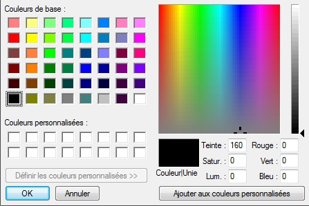
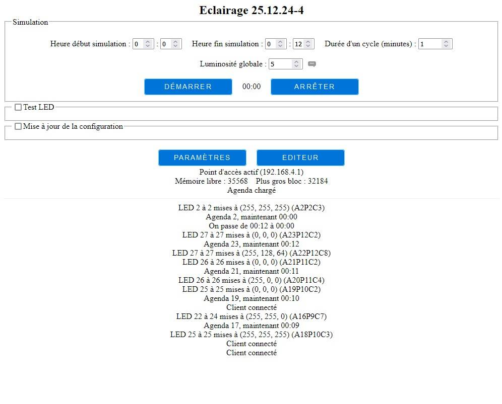
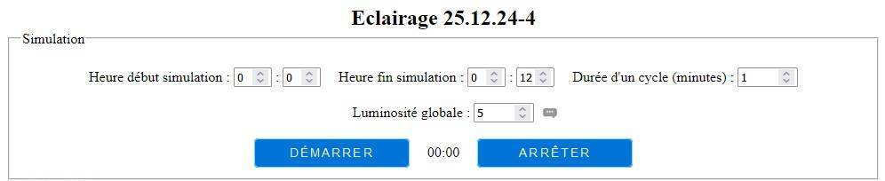
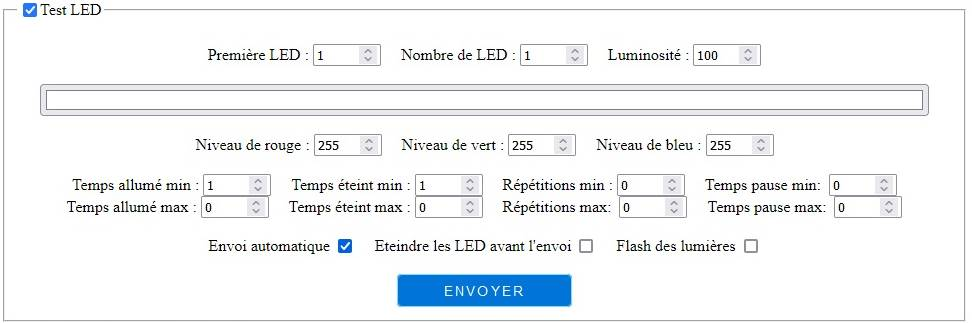
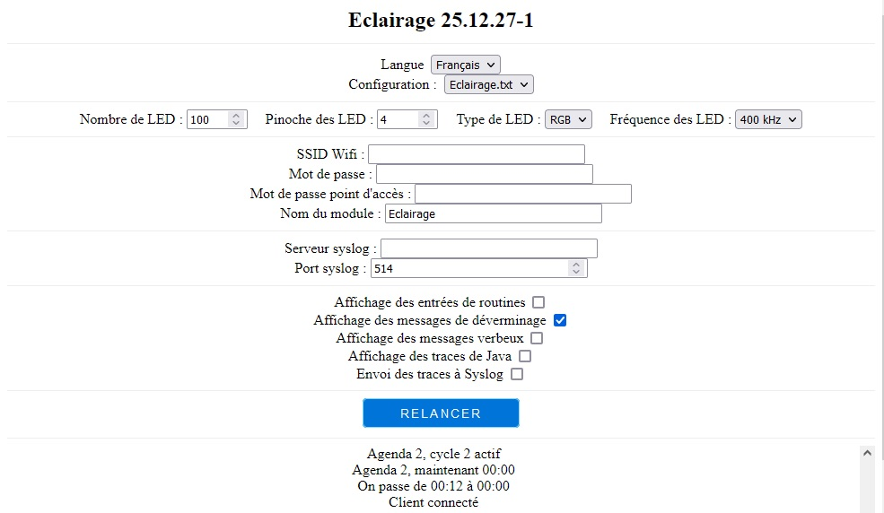
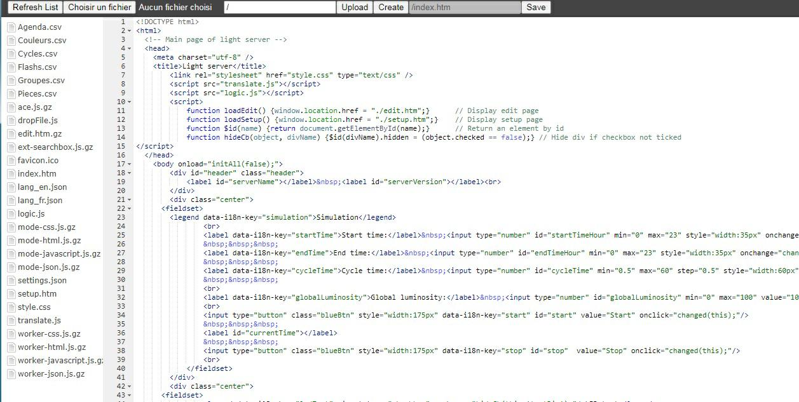

# Model light management / Gestion de l'éclairage d'une maquette

[Cliquez ici pour la version française plus bas dans ce document](#france)

# <a id="english">English version</a>

## Presentation

This application drives a (large) set of LED giving a predefined scenario.

It has been specially developed to light a complex model, with dozen of lighting points.

In order to considerably reduce cabling, we used individually addressed LED ribbons (like NeoPixels), inserted into model, making links between elements with only 3 wires : a power (+5V and common ground) and a command wire.

Due to very low cost of these ribbons (few bucks for 150 LED over a 5 meters ribbon), we decided too "loose" few LED to make links between floors, instead of link ribbons between them with wires, to suppress false contacts risk.

You can find these ribbons with 30, 60 and even 144 LED per meter, which allows interesting light density...

It's even not forbidden to use it over models, to simulate day light in a dark room.

Base idea is to present to spectators ue simulation cycle over a limited (short) period (for example a full day in 7 minutes). If cycle is too long, they will leave.

Time is managed by an agenda, which indicates time (hours and minutes) we should activate (or deactivate) the following 3 types of elements :

- fixed, where lights stay in the same stare during specified agenda time. For example, turn room light on at 7PM, and off at 10:15PM,
- flashes which are turned on and off at regular interval. For example, turned on for a second, and off for half a second,
- cycles, used in complex sequences of lighting, like traffic lights.

Flashes and cycles can be defined on fixed or random base. Random base can be used for example to simulate arc welding. Durations are specified in milliseconds, allowing short and quick actions.

It's possible to set a global luminosity (to adapt lighting to the room luminosity where models are installed) and individually (to reduce room light level if over lighted).

Application run on an ESP8266, either connected to an existing WiFi network, or creating its own network (through a local access point). Settings are done through an embedded web server, which also allows LED positioning, color and flashes real time tests. Messages are displayed on web interface, but can also be sent to a `syslog` server.

Application is autonomous and is able to run without external action nor connection, using last known parameters. You just have to power ESP on.

This document will now detail configuration files structure and content, easier to use to load large amounts of data than Web interface.

Web interface will be detailed then.

## Data description

As previously seen, light related data is written to a file.

It's possible to load multiple configuration files in ESP, a drop down list in parameters page is used to select the one to run.er.

File names is let to users' needs, but file type should be `.txt`.

We've got 6 data types, leading to 6 concepts and 6 file sub-parts in configuration file:

- Rooms, associating LED to a location,
- Groups, merging rooms,
- Colors, describing used colors,
- Cycles, describing cyclic series of lighting (like traffic lights),
- Flashes, flashing...
- Agenda, driving rooms, groups, cycles and flashes activation and deactivation giving a simulation time.

Internal format is CSV type (values are separated by ";").

Each kind of data is starting by a header, allowing to structure data/

Edition can be done by a spreadsheet application (LibreOffice, OpenOffice, even Excel for the most courageous ;-) or with a simple text editor (like NotePad++ or equivalent).

Each part is separated of the next one by an empty line.

It's possible to add comments in file. These comments should be put at end of line, and start by the `#`. Note that everything following comment on the line will simply be ignored.

If you don't specify some zones, application will use default value (often 0, but not systematically : for example, luminosity is set to 100% by default).

Empty lines are ignored.

Sub-parts can be defined in any order, as long as a line don't reference not yed defined data.

As recommendation, using in this order `Rooms`, `Groups`, `Colors`, `Flashes`, `Cycles` and `Agenda` will lake it.

Headers of empty sections can be omitted.

Here's an example of empty file:
```
Rooms;First LED;LED count;Luminosity # Rooms table starts here

Groups;Room # Groups table starts here

Colors;Red;Green;Blue # Colors table start here
Black;0;0;0           # First color is used to turn LED off

Flashes;Room/group;Color;MinOn;MaxOn;MinOff;MaxOff;MinRepeat;MaxRepeat;MinPause;MaxPause # Flashes table starts here

Cycles;Room/group;Color;MinWaitTime;MaxWaitTime # Cycles tables starts here

Date;Room/group/cycle/flash;Color/active;Luminosity # Agenda table starts here

```
FYI, only first zone of each header is tested (and should be identical to this example). It's possible to modify all other header fields to match your requirements.

Note that accents encoding varies giving operating systems. It may be judicious not using them into configuration files, their display may be fun ;-)

### Rooms

They define LED concerned by a room

You should indicate number of first concerned LED, count of LED in the room and relative room luminosity. If luminosity is not specified, default value will be 100%.

As example, here's part of defining 6 LED used to simulate 2 traffic lights:
```
Rooms;First LED;LED count;Luminosity
Light1Green;1;1;100
Light1Orange;2;1;100
Light1Red;3;1;100
Light2Green;4;1;100
Light2Orange;5;1;100
Light2Red;6;1;100

```
Note that a LED can be included in multiple rooms.

### Groups

They merge some rooms under a given name (to define a building for example). You can also use them to group series of non contigous LED.

You have to give each concerned room under the same group name.

For example:
```
Groups;Room
#Define "Right corner" group based on room 1, 2, 8 and 9
Right corner:R1
Right corner:R2
Right corner:R8
Right corner:R9

```
Note that a room can be part of multiple groups.

### Colors

Indicates, under a given name, red, green and blue level (from 0 to 255) to give to light.

As first color is used to turn LED off, it may be judicious to define it to `Black` (0,0,0).

For example:
```
Colors;Red;Green;Blue
Black;0;0;0
Green;0;255;0
Orange;255;128;0
Red;255;0;0

```
### Cycles

They allow to program sequences for turning light on and off, in any order, giving any color, and with a different duration between each change. Traffic lights are good example.

You have to give cycle name, room or group name, color to set, time (milliseconds) to wait before next step and optionally a high limit for (random) wait.

For example, to define a traffic lights with 2 directions (Light1 for a direction and light 2 for the perpendicular one), you may specify it as:
```
Cycles;Room/group;Color;MinWaitTime;MaxWaitTime
TrafficLight;Light2Red;Red # Turn light 2 Red on, without waiting (to start cycle)
TrafficLight;Light1Green;Green;5000 # Turn light 1 Green on and wait for 5 seconds
TrafficLight;Light1Green; # Turn light 1 Green off², without waiting
TrafficLight;Light1Orange;Orange;1000 # Turn light 1 orange on and wait for one second
TrafficLight;Light1Orange # Turn light 1 orange off, without waiting
TrafficLight;Light1Red;Red;2000 # Turn light 1 Red on and wait for 2 seconds
TrafficLight;Light2Red; # Turn light 2 Red off, without waiting
TrafficLight;Light2Green;Green;5000 # Turn light 2 Green on and wait for 5 seconds
TrafficLight;Light2Green # Turn light 2 Green off, without waiting
TrafficLight;Light2Orange;Orange;1000 # Turn light 2 orange on and wait for one second
TrafficLight;Light2Orange # Turn light 2 orange off, without waiting
TrafficLight;Light2Red;Red;2000 # Turn light 2 Red on and wait for 2 seconds
TrafficLight;Light1Red # Turn light 1 Red off, without waiting

```
If color is not defined, we'll use first line of `Colors` (explaining why it may be judicious to define it to `Black`). If `MinWaitTime` is not specified, we'll use 0. Same thing for `MaxWaitTime`

if `MaxWaitTime` is defined, wait time will be a random time between `MinWaitTime` and `MaxWaitTime`.

Don't forget ti activate `TrafficLight` cycle in agenda (as described later, using:
```
Date;Room/group/cycle/flash;Color/active;Luminosity
00:00;TrafficLight;1 #Activate "TrafficLight" cycle at midnight.

```
We can then group all this data into a `TrafficLight.txt` containing:
```
Rooms;First LED;LED count;Luminosity
Light1Green;1;1;100
Light1Orange;2;1;100
Light1Red;3;1;100
Light2Green;4;1;100
Light2Orange;5;1;100
Light2Red;6;1;100

Groups;Room

Colors;Red;Green;Blue
Black;0;0;0
Green;0;255;0
Orange;255;128;0
Red;255;0;0

Flashes;Room/group;Color;MinOn;MaxOn;MinOff;MaxOff;MinRepeat;MaxRepeat;MinPause;MaxPause

Cycles;Room/group;Color;MinWaitTime;MaxWaitTime
TrafficLight;Light2Red;Red # Turn light 2 Red on, without waiting (to start cycle)
TrafficLight;Light1Green;Green;5000 # Turn light 1 Green on and wait for 5 seconds
TrafficLight;Light1Green; # Turn light 1 Green off², without waiting
TrafficLight;Light1Orange;Orange;1000 # Turn light 1 orange on and wait for one second
TrafficLight;Light1Orange # Turn light 1 orange off, without waiting
TrafficLight;Light1Red;Red;2000 # Turn light 1 Red on and wait for 2 seconds
TrafficLight;Light2Red; # Turn light 2 Red off, without waiting
TrafficLight;Light2Green;Green;5000 # Turn light 2 Green on and wait for 5 seconds
TrafficLight;Light2Green # Turn light 2 Green off, without waiting
TrafficLight;Light2Orange;Orange;1000 # Turn light 2 orange on and wait for one second
TrafficLight;Light2Orange # Turn light 2 orange off, without waiting
TrafficLight;Light2Red;Red;2000 # Turn light 2 Red on and wait for 2 seconds
TrafficLight;Light1Red # Turn light 1 Red off, without waiting

Date;Room/group/cycle/flash;Color/active;Luminosity
00:00;TrafficLight;1

```

To have a version with 2 traffic lights per way, we can define lights 3 and 4 the same way as 1 and 2, define groups for each way and color, and use these groups.

For example:
```
Rooms;First LED;LED count;Luminosity # Rooms table starts here
L1G;1;1;100
L1O;2;1;100
L1R;3;1;100
L2G;4;1;100
L2O;5;1;100
L2R;6;1;100
L3G;7;1;100
L3O;8;1;100
L3R;9;1;100
L4G;10;1;100
L4O;11;1;100
L4R;12;1;100

Groups;Room # Groups table starts here
Light1Green;L1G
Light1Green;L3G
Light1Orange;L1O
Light1Orange;L3O
Light1Red;3;1;L1R
Light1Red;3;1;L3R
Light2Green;L2G
Light2Green;L4G
Light2Orange;L2O
Light2Orange;L4O
Light2Red;L2R
Light2Red;L4R

Colors;Red;Green;Blue # Colors table start here
Black;0;0;0
Green;0;255;0
Orange;255;128;0
Red;255;0;0

Flashes;Room/group;Color;MinOn;MaxOn;MinOff;MaxOff;MinRepeat;MaxRepeat;MinPause;MaxPause # Flashes table starts here

Cycles;Room/group;Color;MinWaitTime;MaxWaitTime # Cycles tables starts here
TrafficLight;Light2Red;Red # Turn light 2 Red on, without waiting (to start cycle)
TrafficLight;Light1Green;Green;5000 # Turn light 1 Green on and wait for 5 seconds
TrafficLight;Light1Green; # Turn light 1 Green off², without waiting
TrafficLight;Light1Orange;Orange;1000 # Turn light 1 orange on and wait for one second
TrafficLight;Light1Orange # Turn light 1 orange off, without waiting
TrafficLight;Light1Red;Red;2000 # Turn light 1 Red on and wait for 2 seconds
TrafficLight;Light2Red; # Turn light 2 Red off, without waiting
TrafficLight;Light2Green;Green;5000 # Turn light 2 Green on and wait for 5 seconds
TrafficLight;Light2Green # Turn light 2 Green off, without waiting
TrafficLight;Light2Orange;Orange;1000 # Turn light 2 orange on and wait for one second
TrafficLight;Light2Orange # Turn light 2 orange off, without waiting
TrafficLight;Light2Red;Red;2000 # Turn light 2 Red on and wait for 2 seconds
TrafficLight;Light1Red # Turn light 1 Red off, without waiting

Date;Room/group/cycle/flash;Color/active;Luminosity # Agenda table starts here
00:00;TrafficLight;1

```

### Flashes

They allow to flash lights at regular (or not) interval.

Note that after a flash, previous LEd color and intensity is restored.

You have to specify flash name, room or group name, minimal light on, light off and pause between sequences in milliseconds, as well as count of repetition. You may also specify random values giving `Max` value in addition to `Min`.

for example, and minimum activation time of 10 and a maximum of 100 will produce a random value between 10 and 100 (inclusive) at each activation.

To get a flash every seconds, use :
```
Flashes;Room/group;Color;MinOn;MaxOn;MinOff;MaxOff;MinRepeat;MaxRepeat;MinPause;MaxPause
Flash 1;R1;White;1;0;0;0;1;0;1000;0

```

For 3 short (1 ms) flashes followed by a one second wait, use:
```
Flashes;Room/group;Color;MinOn;MaxOn;MinOff;MaxOff;MinRepeat;MaxRepeat;MinPause;MaxPause
Flash 2;R1;White;1;0;1;0;3;0;1000;0

```
An arc welding simulation can be as:
```
Flashes;Room/group;Color;MinOn;MaxOn;MinOff;MaxOff;MinRepeat;MaxRepeat;MinPause;MaxPause
Arc Welding;R1;White;10;30;5;20;5;30;20;5000

```
Well get a flash with a duration between 10 and 30 ms, followed by a return to previous color during 5 to 20 ms, repeated between 5 to 30 times, with a pause between 20 ms and 5 seconds.

You may want to test other values with web interface.

### Agenda

It allows to specify activation and deactivation of rooms, groups, flashes or cycles at a given simulation time.

For rooms and groups, you have to specify simulation time, room or group name, color and luminosity. If color is not given, first line of color list will be used. If intensity is not given, 100 will be used.

For cycles and flashes, you have to give simulation time, cycle or flash name, and an activation flag (O= not activated, not null value = activated). If activation flag is not specified, we'll use zero (deactivated).

For example:
```
Date;Room/group/cycle/flash;Color/active;Luminosity
06:00;Flash 1 # Deactivate flash 1 at 6AM (it's activated at 8PM)
09:30;Arc Welding;1 # Activate "Arc Welding" flash at 9:30AM
10:00;Arc Welding # Deactivate "Arc Welding" flash at 10AM
11:00;Arc Welding;1 # Activate "Arc Welding" flash at 11AM
12:00;Arc Welding # Deactivate "Arc Welding" flash at noon
18:30;P1;White # Light room 1 in white at 6:30PM
18:45;P2;White;80 # Light room 2 in white at 80% at 6:45PM
19:00;P3;Yellow # Light room 3 in yellow at 7PM
20:00;P2;White # Light room 2 in white at 100% at 8PM
20:00;Flash 1;1 # Activate flash 1 at 8PM
22:30;P3 # Turn room 3 off at 10:30PM
23:00;P1 # Turn room 1 off at 11PM
23:00;P2 # Turn room 2 off  at 11PM

```
## Embedded Web server

Interaction between user and ESP is done through an embedded web server, using a browser from a smart-phone or a computed.

Address to use depend on parameters given by user.

In most common case, where module is not connected to an existing WiFi, you have to connect smart-phone or computer to module internal access point (with default values, it's named `ModelLibghts_xxxxxx` where `xxxxxx` is last 6 characters of ESP MAC address). You have to connect then by `http://192.168.4.1/`

If you gave a WiFi SSID (which has been joined in the first 10 seconds of module life), you'll be connected to this network, and IP given by this network's router.

In all cases, network name and IP to use will be written on USB ESP console port at start.

### Main page

Embedded web server main page `/` or `/index.htm` looks like:


It has few parts:

#### Header


First line contains module's name.

`Simulation` frame contains ... simulation data (not so common, isn't it? ;-)

You'll find here simulation starting and ending time. Normally, you should have `00:00` and `23:59`, but it's possible though these zones to reduce interval, either to only show part of day, or finely debug complicated changes.

As soom as times are specified, you should indicate simulation cycle duration, in minutes.

Note that reducing interval will sensibly slow it down.

As starting point, duration between 5 to 10 minutes seems reasonable.

Next line is used to set global LED luminosity, to adapt it to presentation's room light (in principle, we reduce global luminosity in black).

We start and stop simulation with buttons of same name.

Simulated time is displayed between these two buttons. It's updated in real time when simulation is active.

#### LED test frame


Frame contents is displayed only when `LED test` is ticked.

As you can imagine, it allows to test LED (and flashes).

It allows to turn light on (giving a color) or off (giving black as (0,0,0) a continuous series of LED (useful to identify LED in a room), using a given color (useful to calibrate colors giving ribbon or room wall color) with a given luminosity (useful to calibrate a room with multiple LED).

You have to give first LED number to use into `First LED` (ribbon first LED is number #1), specify number of LED to use into `LED count` and luminosity into `Luminosity`. Not so complicated?

If `Automatic send` is ticked, actions will be executed immediately after changing these zones. If not, you have to click on `Send` to send commands to LED.

if `Turn off all LED before sending` is ticked, all LED will be turned off before applying requested changes. Else, not concerned LED will keep their last state.

Color is set:

- either giving values (between 0 and 255) into `Red level`, `Green level` et `Blue level` in corresponding zones,

- or clicking on the long box between LED numbers and color levels. In this case, an operating system depending window will appear. Here's, for example, what a Windows machine will show:

  
  
  You can either click on an existing color already defined on left, or use mouse on right to select color, setting saturation on rightest position from white (top) to black (bottom) to maximum color (middle).

Note that if `Automatic send` is ticked, effects on LED will be immediately done, which avoids validating color, clicking on `Send` and going back on color selection.

The 2 following lines allows to define flash parameters.

Zones `LED on time`, `LED off time`, `Repeat count` and `Pause time` are prefixed by `Min` on the first line and `Max` on the second.

When `Max` values are defined, `Min` and `Max` values are defining random limits that should be used. If they're not defined (or lower than `Min`), `Min` corresponds to fixed value to be used (no random part).

`Flash lights` should be ticked to flash LED (else they will stay fixed).

Note that if `Automatic send` is ticked, effects on LED will be immediate, each modification will reinitialize flash cycle.

#### Configuration file update


As `LED test` frame, this frame is only visible if ticked.

You can use it to load a configuration file (previously described).

It's possible to indicated file:

- either clicking on `Browse...`, then select file in dialog box that will open,,
- or drag & drop file on `Drop configuration file here` frame.

File will then be uploaded into ESP, and analyzed.

Errors will be displayed in trace frame, final state displayed in status frame.

#### Status frame


This frame allows to :

- display parameters page clicking on `Setup` (see here under),
- display file editor clicking on `Edit` (see here under again),
- display a line giving WiFi state (local access point or existing WiFi) and ESP IP address,
- display a line with available memory and size of largest block,
- display a line giving status of last configuration file loading (`<Configuration file name> loaded` if no error, error messages else).

#### Trace frame


This frame contains list of ESP sent traces, last on top of frame.

Explanations on different messages can be found on `System generated traces` chapter.

### System settings page

Settings page web server `/setup` looks like:


First line contains a drop down selector `Language` indicating ... language to be used to display this page (well done, no?).

If browser supports French, we'll use French. Else , we'll automatically switch to English.

Note that language used by server is defined at compilation time.

`Configuration file` drop down allows to select configuration file to be used. It shows available configuration files available on this ESP.

Next line is used to define ribbon characteristics:

- Used `LED count`,
- `LED pin ` where command wire is connected to. Warning, value given here is GPIO number (different of `Dn` indication painted on circuit). FYI, on an ESP8266, we have : D0 = GPIO16, D1 = GPIO5, D2 = GPIO4, D3 = GPIO0, D4 = GPIO2, D5 = GPIO14, D6 = GPIO12, D7 = GPIO13, D8 = GPIO15). For example, if ribbon is connected on D2 index, you should indicate 4 (which is the corresponding GPIO,
- `LED type` (RGB , RBG, GRB, GBR, BRG, BGR). To determine ribbon type, use `Test LED` frame, set color to (255, 0, 0). If nothing happens (meaning that `Automatic send` is not ticked), click on `Send`. Have a look to first LED. If red, use `R` as first character, green use `G`, and blue `B`. Set then color to (0, 255, 0) and determine the second character the same way. Choose then type starting with these 2 characters in the list,
- `LED frequency`, which can be set to 400 kHz or 800 kHz. If no LED show up after clicking on `Send`, change value.

A message will ask you to restart ESP in order to activate these changes.

Next frame describe ESP network parameters:

- `WiFi SSID` indicates existing WiFi SSID to connect module to. If not defined, or can't be connected during the first 10 seconds of module life, we'll switch to local ESP access point,
- `Password` indicates password associated to preceding WiFi SSID, if it has one,
- `Access Point password` indicates password to be used with the ESP locally created local access (which won't be protected if let empty),
- `Module name` specifies network name given to module (to distinguish other modules, if needed).

Following frame gives information to be used if you want to send trace to a `syslog` server:

- `Syslog server` gives name or IP address of server (empty, no `syslog` will be used),
- `Syslog port` gives port number to use (514 by default).

Then we have flags used to control message types to display/send. They're all used to debug:

- `Display routing entering` is used to display names of main routines when entered,
- `Display debug messages` makes what we think it will,
- `Display verbose messages` add ore messages to the trace,
- `Display Java traces` display traces of JavaScript messages,
- `Send traces to syslog` allows to send trace to `syslog` server.

`Restart` button is used to ... restart module (still well done!). It's useful when modifying a parameter needing rebooting ESP (like parameters linked to LED or WiFi).

Last part contains trace already explained before.

### Managing embedded files

`/edit` embedded files management page looks like:


It displays list of file on ESP in the left part, allows to modify, delete, download files, create an empty file or load a file from computer or smart-phone.

To be used on request.

## System geTrafficLightnerated traces

System generates more or less traces (depending on setting previously explained).

These traces are coming from two sources: ESP and browser.

### ESP traces

Tehse rare traces sent by ESP itself, to indicate its state and report errors it may encounter. We have:

#### Configuration file analysis traces

As already explained, ESP analyze configuration file when it starts, and after each file download.

It's possible to detect incoherences during this analysis. They'll be signaled by a message giving information on the issue. Displaying an error will stop analysis and prohibit simulation activation (but will let LED test and new configuration file download).

In following text, variable parts will be included within `< >`. For example, `<line number>` will be replaced by the corresponding file line number.

We'll find:

- `Can't open file <file name>`: problem opening file,
- `Bad file header <header line> in <file name>`: first line of file part seems not to be valid, should be `Agenda`, `Rooms`, `Colors`, `Cycles`, `Groups` ou `Flashes`,
- `File missing for <file name>`: file has not been found,
- `<header type> header already defined in <file name>, before line <line number>`: a type of header is defined twice in the file, second time at a given line,
- `Bad field count (<field count>) line <line number> of <file name>`: a line has either less fields than minimum required, or more than the maximum allowed,
- `Illegal number <number> field <field number> line <line number> of <file name>`: a value is illegal for a field,
- `Out of range <value> field <field number> line <line number> of <file name>`: a value is out of allowed range,
- `Room <room name> not found line <line number> of <file name>`: room (group, cycle or flash) not found,
- `Color <color name> not found line <line  number> of <file name>`: color not found,
- `Illegal time <time>, field <field number> line <line number> of <file number>`: an illegal time has been given,
- `Incorrect ending LED <led number>, line <line number> of <file name>`: LED number (computed from first LED and LED count) is out of ribbon,
 -`Unknown error <error number>, file <file name>, line <line number>, integer <integer value>, string <string value>`: an unknown error has bed detected, all parameters are displayed. Please forward data to developer.

#### Simulation execution traces

Program sends some messages to inform user about certain changes.

Main are:

- `Agenda <agenda line number>, now <simulation time>`: activation of a line of agenda at given simulation time. Allow to follow whre we're in simulation and which line(s) will be executed,
- `Going from <ending time> to <staring time>`: loops at end of simulation to start of simulation,
- `LED <first LED> to <last LED> set to (<red>, <green>, <blue>) (A<agenda line number>R<room line number>C<cycle line number>)`: Set LED to specific color giving agenda, room and cycle line number,
 - `LED <first LED> to <last LED> set to (<red>, <green>, <blue>) (A<agenda line number>G<group line number>R<room line number>C<cycle line number>)`: Set LED to specific color giving  agenda, group and cycle line number, 
- `LED <first LED> to <last LED> set to (<red>, <green>, <blue>) (F<flash line number>R<room line number>)`: Set LED to specific color giving flash and room number,
- `LED <first LED> to <last LED> set to <previous color> (F<flash line number>R<room line number>)`:  Set LED to previous color giving flash and room number,
- `LED <first LED> to <last LED> set to (<red>, <green>, <blue>), flash <flash flag> (User)`: Set LED to specific color, with (or without) flash,
- `LED <first LED> to <last LED> set to ((<red>, <green>, <blue>) for <duration> ms (S<sequence line number>R<room line number>C<cycle line number>)`: Set LED to specific color giving sequence, room and cycle line number) for a given duration, 
- `Agenda flag %d line <agenda line number> is unknown`: an illegal flag as been seen, please forward to developer,
- `Agenda <agenda line number>, cycle <cycle number> active` (or inactive): a cycle has been (de)activated by agenda,
- `Agenda <agenda line number>, flash <flash number> active` (or inactive): a flash has been (de)activated by agenda,
- `Luminosity <global luminosity>`: global luminosity has been changed,
- `Clearing all lights`: all LED have been turned off,
- `Can't find cycle <cycle number> sequence <sequence number>, ignored`: an illegal cycle/sequence number has been detected. Please forward to developer. 

#### Other traces

Other messages can been sent. It's possible to complain to developer if they're not sufficiently clear ;-)

### Browser traces

In addition to traces generated by server, other errors can be generated by browser and be displayed in trace frame.

In particular, Java traces, if they're activated, and fatal errors when occurring in browser.

## Web server supported requests

Embedded web server answer to the following URL:

- `/` : display home page,
- `/status` : returns program state as JSON data,
- `/setup` : display setup page,
- `/settings` : returns parameters as JSON data,
- `/configs` : returns configuration file list,
- `/debug` : returns internal variables to debug,
- `/log` : returns last saved log lignes,
- `/edit` : manages and edit file system,
- `/tables` : returns internal tables content,
- `/rest/restart` : restarts ESP,
- `/command/enable/enter` : arms `Display routing entering` flag,
- `/command/enable/debug` : arms `Display debug messages` flag,
- `/command/enable/verbose` : arms `Display verbose messages` flag,
- `/command/enable/java` : arms `Display Java traces` flag,
- `/command/enable/syslog` : arms `Send traces to syslog` flag,
- `/command/disable/enter` : disarms `Display routing entering` flag,
- `/command/disable/debug` : disarms `Display debug messages` flag,
- `/command/disable/verbose` : disarms `Display verbose messages` flag,
- `/command/disable/java` : disarms `Display Java traces` flag,
- `/command/disable/syslog` : disarms `Send traces to syslog` flag,
- `/languages` : Returns supported languages list,
- `/changed` : change value of a variables (internal use),
- `/upload` : upload a file (internal use).

# <a id="france">Version française</a>
## Présentation

Cette application permet de gérer un ensemble de LED adressables selon un scénario prédéterminé.

Elle a été initialement conçue pour éclairer une maquette complexe, comportant plusieurs dizaines de points d'éclairage.

Afin de réduire considérablement le câblage, on a utilisé des rubans de LED adressables (genre NéoPixels) insérés dans les bâtiments de la maquette, de sorte que les liaisons entre les différents bâtiments soient réalisées avec seulement 3 conducteurs : une alimentation (masse et +5V) et un fil de transport des commandes.

Noter que le très faible coût de ces rubans (quelques Euros pour 150 LED sur 5 mètres de ruban), on a décidé de "perdre" quelques LED pour assurer la liaison entre les étages, plutôt que de relier les rubans entre eux par des fils, supprimant de fait les risques de faux contacts.

Ces rubans se trouvent en 30, 60 et même 144 LED au mètre, ce qui permet une densité d'éclairage intéressante ... 

Il n'est d'ailleurs pas interdit d'en utiliser au dessus des maquettes pour simuler la lumière du jour dans une pièce sombre.

L'idée de base est de présenter aux spectateurs un cycle de simulation sur une durée réduite (par exemple, une journée complète en 7 minutes). Si la durée d'un cycle est trop longue, ils s'ennuieront et s'en
iront.

La gestion du temps est gérée par l'agenda, qui indique à quelle heure (simulée) on active ou on désactive les 3 types d'éléments suivants :

- fixe, où l'état de l'éclairage reste fixe pendant la durée spécifiée dans l'agenda. Par exemple, allumer la pièce à 19:00 et l'éteindre à
  22:15,
- flashs et clignotants qui flashent/clignotent à intervalle régulier. Par exemple allumé pour une seconde, éteint pour 0,5 secondes,
- cycles, utilisés pour les séquences d'allumage complexes. Par exemple les feux de circulation ou les chenillards.

Flash, clignotants et cycles peuvent être définis sur des durées constantes ou aléatoires dans certaines limites. Ces aléas sont utiles par exemple pour simuler des éclairs de soudage à l'arc. Ces durées sont spécifiées en millisecondes, ce qui permet des actions extrêmement courtes ou rapides.

Il est possible de régler l'intensité maximale de l'éclairage globalement (pour l'adapter à la luminosité de la pièce où la maquette est installée) et individuellement (pour réduire le niveau de lumière d'une pièce sur éclairée).

L'application fonctionne sur un ESP8266, qui peut soit se connecter sur un réseau WiFi existant, soit créer son propre réseau Wifi. Le paramétrage s'effectue au travers d'un serveur Web embarqué, qui permet également de trouver le positionnement des LED et tester des couleurs, clignotants ou flashs en temps réel. Les messages sont affichés sur l'interface Web, et peuvent également être envoyés sur un serveur `syslog`.

L'application est autonome et sait fonctionner sans action extérieure ni connexion, en utilisant les derniers paramètres connus. Il suffit juste de la mettre l'ESP sous tension.

La suite de ce document détaille tout d'abord la structure et le contenu des fichiers de configuration, plus pratiques que l'interface Web pour charger de grandes quantités de données.

On verra ensuite l'utilisation de l'interface Web.

## Description des données utilisées

Comme vu précédemment, les données relatives aux lumières sont écrite dans un fichier.

Il est possible de charger plusieurs fichiers de configuration dans l'ESP, une liste déroulantes dans la page de paramètres permet de choisir celle à activer.

Le nom de ces fichiers est laissé à la discrétion de l'utilisateur, mais l'extension doit être `.txt`.

On a 6 types de données, correspondant à autant de concepts différents (et de sous parties dans le fichier de configuration) :

- Les pièces, qui associent des LED à une localisation,
- Les groupes, qui regroupent plusieurs pièces,
- Les couleurs, qui décrivent les couleurs utilisées,
- Les cycles, qui décrivent des suites cycliques d'allumage et d'extinction (genre feux tricolores),
- Les flashs et clignotants, qui font ce qu'on attend d'eux,
- L'agenda, qui gère les activations et désactivations des pièces, groupes, cycles et flashs/clignotants en fonction de l'heure de simulation.

Le format interne utilisé est de type CSV (valeurs séparées par des ";").

Chaque type de données est précédé d'une entête qui permet de s'y retrouver lorsqu'on édite les données.

Cette édition peut être faite avec un tableur (LibreOffice, OpenOffice, voire même Excel pour les plus téméraires ;-) ou à l'aide d'un simple éditeur de texte (genre NotePad++ ou similaire).

Chaque partie est séparée de la suivante par une ligne vide.

Il est possible d'ajouter des commentaires dans le fichier, histoire de s'y retrouver. Ces commentaires doivent figurer en fin de ligne, et débuter par le caractère `#`. Noter que tout ce qui suit le commentaire sur la même ligne sera simplement ignoré.

Certaines zones peuvent ne pas être spécifiées. Dans ce cas, on utilisera des valeurs par défaut (généralement 0, mais pas systématiquement : par exemple, la luminosité est mise à 100 par défaut).

Les lignes vides sont ignorées.

Les différentes sous parties peuvent être définies dans le fichier dans un ordre quelconque, sous réserve qu'une partie ne fasse pas référence à une donnée non encore décrite.

Il est donc recommandé d'utiliser l'ordre `Pièces`, `Groupes`, `Couleurs`, `Flashs`, `Cycles` et `Agenda`.

L'entête des sous parties vides peut être supprimée.

Si on ne respecte pas cet ordre, on aura un message d'erreur indiquant qu'une pièce ou couleur n'existe pas.

Voici un exemple de fichier vide :
```
Pieces;Premiere lampe;Nombre de lampes;Luminosite # Table des pieces

Groupes;Piece # Table des groupes

Couleurs;Rouge;Vert;Bleu # Table des couleurs
Noir;0;0;0               # La premiere couleur est utilisee pour eteindre les LEDS

Flashs;Piece/groupe;Couleur;On mini;On maxi;Off mini;Off maxi;Nb mini;Nb maxi;Pause mini;Pause maxi # Table des flashs

Cycles;Piece/groupe;Couleur;Attente mini;Attente maxi # Table des cycles

Date;Piece/groupe/cycle/flash;Couleur/actif;Luminosite # Agenda

```
Pour information, seule la première zone de chaque entête est testé (et doit être identique a celles de cet exemple). Il est possible de modifier les autres zones  d'entête pour les faire correspondre à ses besoins.

Noter que l'encodage des accents varie selon les systèmes d'exploitation. Il est prudent de ne pas en utiliser dans les fichiers de configuration, leur restitution pouvant amener à des résultats amusants ;-)

### Les pièces

Elle définissent les LED concernées par une pièce.

On indique le numéro de la première LED concernée, le nombre de LED dans la pièce, et l'intensité relative de la pièce. Si l'intensité n'est pas spécifiée, elle est mise à 100% par défaut.

Par exemple, voici la partie correspondant à la définition de 6 LED, utilisées pour définir 2 feux de signalisation :
```
Pieces;Premiere lampe;Nombre de lampes;Luminosite
Feu1Vert;1;1;100
Feu1Orange;2;1;100
Feu1Rouge;3;1;100
Feu2Vert;4;1;100
Feu2Orange;5;1;100
Feu2Rouge;6;1;100

```
Noter qu'une LED peut figurer dans plusieurs pièces.

### Les groupes

Ils regroupent des pièces sous un nom donné (pour définir par exemple un bâtiment). On peut aussi les utiliser pour regrouper des séries de LED non contiguës.

On indique, sous le même nom de groupe, chaque pièce concernée.

Par exemple:
```
Groupes;Piece
#Définit le groupe "Coin gauche" comme étant composé des pièces 1, 2, 8 et 9
Coin gauche:P1
Coin gauche:P2
Coin gauche:P8
Coin gauche:P9

```
Noter qu'une pièce peut faire partie de plusieurs groupes.

### Les couleurs

On indique, sous un nom donné, les niveaux (entre 0 et 255) de rouge, vert et bleu à affecter à la lampe.

La première couleur du fichier est utilisée pour « éteindre » les LED. Il est habile de la définir sur `Noir` (0,0,0).

Par exemple :
```
Couleurs;Rouge;Vert;Bleu
Noir;0;0;0
Vert;0;255;0
Orange;255;128;0
Rouge;255;0;0

```
### Les cycles

Ils permettent de programmer des suites d'allumages et d'extinctions dans un ordre quelconque, en spécifiant une durée différente entre chaque changement. Les feux de signalisation sont un bon exemple.

On indique le nom de la séquence, le nom de la pièce ou du groupe, la couleur à affecter, la durée d'attente après l'activation de la séquence, et un éventuel aléa.

Par exemple, pour définir un cycle de feux tricolores, avec 2 feux (Feu1 sur un sens de circulation, Feu 2 sur le sens perpendiculaire), on procède de la façon suivante :
```
Cycles;Piece/groupe;Couleur;Attente;Attente max
Croisement;Feu2Rouge;Rouge #Allume le feu 2, en rouge, à 100% sans attente après l'allumage
Croisement;Feu1Vert;Vert;5000 #Allume le feu 1 en vert et attend 5 secondes
Croisement;Feu1Vert; #Éteint le feu 1 vert, sans attente après l'extinction
Croisement;Feu1Orange;Orange;1000 #Allume le feu 1 en orange et attend une seconde
Croisement;Feu1Orange #Éteint le feu 1 orange, sans attente après l'extinction
Croisement;Feu1Rouge;Rouge;2000 #Allume le feu 1 en rouge et attend 2 secondes
Croisement;Feu2Rouge; #Éteint le feu 2 rouge, sans attente après l'extinction
Croisement;Feu2Vert;Vert;5000 #Allume le feu 2 en vert et attend 5 secondes
Croisement;Feu2Vert #Éteint le feu 2 vert, sans attente après l'extinction
Croisement;Feu2Orange;Orange;1000 #Allume le feu 2 en orange et attend une seconde
Croisement;Feu2Orange #Éteint le feu 2 orange, sans attente après l'extinction
Croisement;Feu2Rouge;Rouge;2000 #Allume le feu 2 en rouge et attend 2 secondes
Croisement;Feu1Rouge #Éteint le feu 1 rouge, sans attente après l'extinction

```
Si la couleur n'est pas définie, on utilise la première couleur de la liste `Couleurs` (d'où l'intérêt de la définir à `Noir`). Si l'attente n'est pas définie, on utilise 0. Pareil pour `attente max`

Si "Attente max" est définie, le temps d'attente utilisé sera une valeur aléatoire comprise ente `Attente` et `Attente max`.

Ne pas oublier d'activer le cycle "Croisement" dans l'agenda (décrit plus loin), par un :
```
Date;Piece/groupe/cycle/flash;Couleur/actif;Luminosite
00:00;Croisement;1 #Active le cycle "Croisement" à 0h00

```
On peut regrouper ces données dans un fichier `Croisement.txt`, qui contiendrait :
```
Pieces;Premiere lampe;Nombre de lampes;Luminosite # Entete des pièces
Feu1Vert;1;1;100
Feu1Orange;2;1;100
Feu1Rouge;3;1;100
Feu2Vert;4;1;100
Feu2Orange;5;1;100
Feu2Rouge;6;1;100

Couleurs;Rouge;Vert;Bleu # Entete des couleurs
Noir;0;0;0
Vert;0;255;0
Orange;255;128;0
Rouge;255;0;0

Cycles;Piece/groupe;Couleur;Attente;Attente max # Entete des cycles
Croisement;Feu2Rouge;Rouge # Allume le feu 2, en rouge, à 100% sans attente après l'allumage
Croisement;Feu1Vert;Vert;5000 # Allume le feu 1 en vert et attend 5 secondes
Croisement;Feu1Vert; # Éteint le feu 1 vert, sans attente après l'extinction
Croisement;Feu1Orange;Orange;1000 # Allume le feu 1 en orange et attend une seconde
Croisement;Feu1Orange # Éteint le feu 1 orange, sans attente après l'extinction
Croisement;Feu1Rouge;Rouge;2000 # Allume le feu 1 en rouge et attend 2 secondes
Croisement;Feu2Rouge; # Éteint le feu 2 rouge, sans attente après l'extinction
Croisement;Feu2Vert;Vert;5000 # Allume le feu 2 en vert et attend 5 secondes
Croisement;Feu2Vert # Éteint le feu 2 vert, sans attente après l'extinction
Croisement;Feu2Orange;Orange;1000 # Allume le feu 2 en orange et attend une seconde
Croisement;Feu2Orange # Éteint le feu 2 orange, sans attente après l'extinction
Croisement;Feu2Rouge;Rouge;2000 # Allume le feu 2 en rouge et attend 2 secondes
Croisement;Feu1Rouge # Éteint le feu 1 rouge, sans attente après l'extinction

Date;Piece/groupe/cycle/flash;Couleur/actif;Luminosite # Entete de l'agenda
00:00;Croisement;1 #Active le cycle "Croisement" à 0h00

```
Pour passer à une version à 2 feux sur chaque sens de circulation, on peut par exemple définir les feux 3 et 4 de la même façon que 1 et 2, définir des groupes pour chaque couleur et sens de circulation, puis d'utiliser ces groupes à la place des pièces.

Par exemple :
```
Pieces;Premiere lampe;Nombre de lampes;Luminosite # Table des pieces
F1V;1;1;100
F1O;2;1;100
F1R;3;1;100
F2V;4;1;100
F2O;5;1;100
F2R;6;1;100
F3V;7;1;10
F3O;8;1;10
F3R;9;1;10
F4V;10;1;10
F4O;11;1;10
F4R;12;1;10

Groupes;Piece # Table des groupes
Feu1Vert;F1V
Feu1Vert;F3V
Feu1Orange;F1O
Feu1Orange;F3O
Feu1Rouge;F1R
Feu1Rouge;F3R
Feu2Vert;F2V
Feu2Vert;F4V
Feu2Orange;F2O
Feu2Orange;F4O
Feu2Rouge;F2R
Feu2Rouge;F4R

Couleurs;Rouge;Vert;Bleu # Table des couleurs
Noir;0;0;0
Vert;0;255;0
Orange;255;128;0
Rouge;255;0;0

Flashs;Piece/groupe;Couleur;On mini;On maxi;Off mini;Off maxi;Nb mini;Nb maxi;Pause mini;Pause maxi # Table des flashs

Cycles;Piece/groupe;Couleur;Attente mini;Attente maxi # Table des cycles
Croisement;Feu2Rouge;Rouge # Allume le feu 2, en rouge, à 100% sans attente après l'allumage
Croisement;Feu1Vert;Vert;5000 # Allume le feu 1 en vert et attend 5 secondes
Croisement;Feu1Vert; # Éteint le feu 1 vert, sans attente après l'extinction
Croisement;Feu1Orange;Orange;1000 # Allume le feu 1 en orange et attend une seconde
Croisement;Feu1Orange # Éteint le feu 1 orange, sans attente après l'extinction
Croisement;Feu1Rouge;Rouge;2000 # Allume le feu 1 en rouge et attend 2 secondes
Croisement;Feu2Rouge; # Éteint le feu 2 rouge, sans attente après l'extinction
Croisement;Feu2Vert;Vert;5000 # Allume le feu 2 en vert et attend 5 secondes
Croisement;Feu2Vert # Éteint le feu 2 vert, sans attente après l'extinction
Croisement;Feu2Orange;Orange;1000 # Allume le feu 2 en orange et attend une seconde
Croisement;Feu2Orange # Éteint le feu 2 orange, sans attente après l'extinction
Croisement;Feu2Rouge;Rouge;2000 # Allume le feu 2 en rouge et attend 2 secondes
Croisement;Feu1Rouge # Éteint le feu 1 rouge, sans attente après l'extinction

Date;Piece/groupe/cycle/flash;Couleur/actif;Luminosite # Agenda
00:00;Croisement;1

```

### Les flashs et clignotants

Ils permettent de faire flasher de façon régulière ou non, les LED d'une pièce.

Noter qu'après le flash, la couleur des LED avant le flash est réutilisée.

On indique le nom du flash, le nom de la pièce ou du groupe, les durées minimales (en millisecondes) d'allumage, d'extinction et de pause entre les séries, ainsi que le nombre de répétition de la séquence d'allumage/extinction. Il est également possible de définir des valeurs variables aléatoires en précisant des valeurs maximales en plus des valeurs minimales.

Par exemple, une durée d'allumage minimale de 10 et maximale de 100 produira une valeur aléatoire entre 10 et 100 (inclus) à chaque activation.

Pour faire un flash bref toutes les secondes, utiliser :
```
Flashs;Piece/groupe;Couleur;On mini;On maxi;Off mini;Off maxi;Nb mini;Nb maxi;Pause mini;Pause maxi
Flash 1;P1;Blanc;1;0;0;0;1;0;1000;0

```

Pour 3 flashs rapides suivis d'une attente d'une seconde :
```
Flashs;Piece/groupe;Couleur;On mini;On maxi;Off mini;Off maxi;Nb mini;Nb maxi;Pause mini;Pause maxi
Flash 2;P1;Blanc;1;0;1;0;3;0;1000;0

```
Une simulation de flash de soudure à l'arc pourrait s'écrire :
```
Flashs;Piece/groupe;Couleur;On mini;On maxi;Off mini;Off maxi;Nb mini;Nb maxi;Pause mini;Pause maxi
Soudure;P1;Blanc;10;30;5;20;5;30;20;5000

```
On enverra un flash d'une durée comprise entre 10 et 30 ms, suivi d'un retour à la couleur initiale pendant 5 à 20 ms, qui sera répété entre 5 et 30 fois, avec une pause entre 20 ms et 5 secondes.

On pourra avantageusement tester d'autres valeurs avec l'interface Web.

### L'agenda

Il permet de spécifier les activations et désactivations de pièces, groupes, flashs ou cycles, à une heure simulée donnée.

Pour les pièces et groupes, on spécifie l'heure de simulation, le nom de la pièce ou du groupe, la couleur et l'intensité. Si la couleur n'est pas donnée, on utilisera la première couleur de la liste. Si l'intensité n'est pas donnée, on utilisera 100%.

Pour les cycles et les flashs, on spécifie l'heure de simulation, le nom du cycle ou du flash, et un indicateur d'activation (0 = désactivé, nombre non nul = activé). Si l'indicateur n'est pas spécifié, il est pris à zéro par défaut (soit désactivé).

Par exemple :
```
Date;Piece/groupe/cycle/flash;Couleur/actif;Luminosite
06:00;Flash 1 # Désactive le flash 1 à 6h (il est activé à 20h)
09:30;Soudure;1 # Active le flash "Soudure" à 9h30
10:00;Soudure # Désactive le flash "Soudure" à 10h
11:00;Soudure;1 # Active le flash "Soudure" à 11:00
12:00;Soudure # Désactive le flash "Soudure" à midi
18:30;P1;Blanc # Allume la pièce 1 en blanc à 18h30
18:45;P2;Blanc;80 # Allume la pièce 2 en blanc à 80% de luminosité à 18h45
19:00;P3;Jaune # Allume la pièce 3 à 19:00
20:00;P2;Blanc # Allume la pièce 2 en blanc à 100% de luminosité à 20:00
20:00;Flash 1;1 # Active le flash 1 à 20h
22:30;P3 # Éteint la pièce 3 à 22h30
23:00;P1 # Éteint la pièce 1 à 23h
23:00;P2 # Éteint la pièce 2 à 23h

```
## Le serveur Web embarqué

L'interaction entre l'utilisateur et l'ESP s'effectue au travers d'un serveur Web embarqué, à l'aide d'un navigateur Web, depuis un téléphone ou un ordinateur.

L'adresse à utiliser dépend du paramétrage fait par l'utilisateur.

Dans le cas le plus courant où le module n'est pas connecté à un réseau WiFi existant, il faut connecter le téléphone ou l'ordinateur au réseau WiFi du module (avec les valeurs par défaut, il se nomme `Eclairage_xxxxxx` où `xxxxxx` représente la fin de l'adresse MAC du module). On se connecte alors au serveur par `http://192.168.4.1/`

Si on a précisé un réseau WiFi (et que celui-ci a pu être joint au démarrage du module), on sera alors connecté à ce réseau, et c'est le routeur du réseau qui lui affectera son adresse IP.

Dans tous les cas, le nom du réseau et l'IP à utiliser sont affichés sur le port console (USB) de l'ESP au lancement.

### La page principale

La page principale `/` ou `/index.htm` du serveur Web embarqué ressemble à :



Elle est composée de plusieurs parties :

#### L'entête



On y trouve tout d'abord le nom du module sur la première ligne.

Le cadre `Simulation` regroupe les informations sur la ... simulation ce qui, je dois le reconnaître, n'est pas banal ;-)

On trouve de quoi saisir les heures et minutes de début et fin de simulation. En principe, on devrait avoir `00:00` et `23:59`, mais il est possible au travers de ces zones de réduire l'intervalle, soit pour ne présenter qu'une partie de la journée, soit pour affiner le déverminage d'un passage compliqué.

Une fois les heures de début/fin saisies, on doit indiquer la durée d'un cycle de simulation, en minutes.

Noter que le fait de réduire l'intervalle de simulation va sensiblement la ralentir.

A titre indicatif, des durées entre 5 et 10 minutes semblent raisonnables.

La ligne suivante permet de régler la luminosité globale des LED, afin de s'adapter à la lumière présente dans la pièce où la simulation se déroule (en principe, on éclaire moins dans le noir qu'en plein jour).

On démarre et arrête la simulation par les boutons du même nom.

L'heure simulée est indiquée entre ces deux boutons. Elle est mise à jour en temps réel lorsque la simulation est active.

#### Le cadre de test des LED



L'intérieur de ce cadre n'est visible que si on coche la case `Test LED`.

Comme on pourrait s'en douter, il permet de tester les LED (et les flashs/clignotants).

Il permet d'allumer (ou éteindre en allumant en `Noir`) une série contiguë de LED (pratique pour identifier les LED d'une pièce) dans une couleur donnée (pratique pour calibrer les couleurs en fonction du ruban ou de la couleur des murs d'une pièce) avec une luminosité donnée (pratique pour calibrer des pièces avec plusieurs LED).

Il est possible de fixer le numéro de la `Première LED` à utiliser (la première LED du ruban est numérotée 1), le `Nombre de LED` à utiliser à partir de la première LED, et la `Luminosité` à affecter à ces LED.

Si la case `Envoi automatique` est cochée, les actions seront effectuées dès la modification d'une des zones. Si ce n'est pas le cas, il faudra cliquer sur `Envoyer` pour envoyer les commandes aux LED.

Si la case `Éteindre les LED avant l'envoi` est cochée, on éteindra l'ensemble des LED du ruban avant d'appliquer les modifications demandées. Dans le cas contraire, les LED non concernées par la modification resteront dans leur dernier état.

La couleur se règle :

- soit en indiquant les valeurs (entre 0 et 255) de `Niveau de rouge`, `Niveau de Vert` et `Niveau de bleu` dans les cases correspondantes.

- soit en cliquant sur la longue case entre les numéros de LED et les niveaux. Dans ce cas, l'affichage de la fenêtre de réglage des couleurs dépend du système utilisé pour interagir avec le serveur Web. Voici ce qu'une machine sous Windows (beurk ;-) montre :

  
  
  On peut soit cliquer sur une couleur déjà définie dans la partie gauche, soit utiliser la souris dans le cadre droit pour sélectionner sa couleur, en utilisant le curseur à l'extrême droite pour régler le niveau de saturation, du blanc (en haut) au noir (en   bas) en passant par la couleur maximale (au milieu).

Noter que si la case `Envoi automatique` est cochée, les effets sur les LED seront immédiats, ce qui évite des allers/retours entre le choix de la couleur et le bouton `Envoyer`.

Les 2 lignes suivantes permettent de définir les paramètres d'un flash/clignotant.

On y trouve les zones `Temps allumé`, `Temps éteint`, `Répétitions` et `Temps pause` post-fixées par `min` sur la première ligne et `max` sur la seconde.

Lorsque les valeurs `max` sont définies, les valeurs `min` et `max` définissent l'intervalle aléatoire à utiliser. Si elles ne le sont pas (ou sont inférieures à la valeur `min`), la valeur `min` correspond à la valeur fixe à utiliser (pas d'aléa).

La case `Flash des lumières` doit être cochée pour que les LED clignotent (sinon, elles resteront fixes).

Noter que si la case `Envoi automatique` est cochée, les effets sur les LED seront immédiats, chaque modification réinitialisant le cycle de flash/clignotement.

#### Le cadre de mise à jour de la configuration


Comme le cadre `Test des LED`, ce cadre n'est visible que si sa case est cochée.

Il est utilisé pour charger un fichier de configuration décrit plus haut.

Il est possible d'indiquer le fichier à utiliser :

- soit en cliquant sur le bouton `Parcourir`, puis en sélectionnant le fichier dans la boîte de dialogue qui va s'ouvrir,
- soit en faisant glisser/lâcher (drag & drop) le fichier sur la case `Déposer le fichier de configuration ici`.

Le fichier sera alors chargé dans l'ESP, et son analyse lancée.

Les éventuelles erreurs seront affichées dans le cadre de trace, l'état final sera repris dans le cadre d'état.

#### Le cadre d'état


Ce cadre permet :

- d'afficher la page de paramètres en cliquant sur le bouton `Paramètres` (voir ci-dessous),
- d'afficher la page de l'éditeur de fichiers en cliquant sur le bouton `Éditeur` (voir ci-dessous),
- d'afficher une ligne indiquant l'état du WiFi (point d'accès local ou WiFi existant) et l'adresse IP de l'ESP,
- d'afficher une ligne indiquant la mémoire disponible, et la taille du plus gros bloc (déverminage),
- d'afficher une ligne indiquant le résultat du dernier chargement des fichiers paramètres (`<Nom du fichier de configuration> chargé` si pas d'erreur, message d'erreur sinon).

#### Le cadre de trace


Ce cadre contient la liste des traces émises par l'ESP, la dernière ligne affichée en haut de la liste.

Des explications sur les différents messages figurent au chapitre `Les traces générées par le système`.

### La page de paramétrage du système

La page de paramétrage `/setup` du serveur Web embarqué ressemble à :



La première ligne contient est un sélecteur `Langue` qui indique ... la langue utilisée pour l'affichage des pages de ce navigateur (bien vu, non ?).

Si le navigateur supporte le Français, on l'utilisera. Sinon, on basculera automatiquement en Anglais.

Noter que la langue du serveur est définie au moment de la compilation.

Le sélecteur `Configuration` permet de choisir le fichier de configuration à utiliser. La liste déroulante montre les différents fichiers disponibles sur l'ESP.

La ligne suivante permet de définir les caractéristiques du ruban utilisé :

- `Nombre de LED` utilisées,
- `Pinoche des LED` sur laquelle le fil de commande du ruban est connecté à l'ESP. Attention, la valeur donnée ici est le numéro de GPIO (différent du numéro `Dn` gravé sur le circuit). Pour info, sur un ESP8266, on a : D0 = GPIO16, D1 = GPIO5, D2 = GPIO4, D3 = GPIO0, D4 = GPIO2, D5 = GPIO14, D6 = GPIO12, D7 = GPIO13, D8 = GPIO15). Par exemple, si le ruban est connecté sur le repère D2, c'est 4 (le numéro de GPIO correspondant) qu'il faut indiquer,
- `Type de LED` (RGB , RBG, GRB, GBR, BRG, BGR). Pour déterminer le type de ruban utilisé, utiliser le cadre test LED, et régler la couleur à (255, 0, 0). Si rien ne s'allume (c'est que `Envoi automatique` n'est pas coché), cliquer sur `Envoyer`. Repérer la couleur de la première LED. Si elle est rouge, utiliser `R` comme premier caractère, verte `G`, bleue `B`. Régler ensuite la couleur à (0, 255, 0) et repérer le second caractère de la même façon. Choisir alors dans la liste le type qui commence par ces 2 caractères,
- `Fréquence des LED`, qui peut être soit 400 kHz ou 800 kHz. Si aucune LED ne s'allume après un clic sur `Envoyer`, changer la valeur.

Un message indiquera que le changement ne sera pris en compte qu'après redémarrage de l'ESP.

Le cadre suivant contient les informations sur les paramètre réseau de l'ESP :

- `SSID Wifi` indique le nom du réseau WiFi existant sur lequel connecter le module. S'il n'est pas défini, ou ne peut être localisé durant les 10 premières secondes de vie de l'ESP, on basculera sur un point d'accès WiFi crée par l'ESP,
- `Mot de passe` indique le mot de passe associé au SSID WiFi précédent, s'il en possède un,
- `Mot de passe point d'accès` indique le mot de passe associé au point d'accès généré par l'ESP (qui ne sera pas protégé si laissé vide),
- `Nom du module` précise le nom réseau associé au module (pour le distinguer des autres modules le cas échéant).

Le cadre suivant contient les informations dans le cas où on souhaiterait envoyer les traces à un serveur de log de type `syslog` :

- `Serveur syslog` indique le nom ou l'adresse IP du serveur (vide, on n'utilisera pas de serveur `syslog`),
- `Port syslog` précise le numéro de port à utiliser (par défaut 514).

Viennent ensuite des indicateurs utilisés pour contrôler les types de message de trace à afficher/envoyer. Ils sont tous utilisés pour le déverminage :

- `Affichage des entrées de routines` est utilisé afficher le nom des principales routines utilisées par le module,
- `Affichage des messages de déverminage` fait ce qu'on pense qu'il va faire,
- `Affichage des messages verbeux` ajoute plus de messages à la trace,
- `Affichage des traces Java` affiche des messages de trace des modules JavaScript,
- `Envoi des traces à Syslog` permet d'activer l'envoi des traces au serveur `syslog`.

Le bouton `Relancer` permet de ... relancer le module (encore bien vu!). Il est utile lorsqu'on modifie un paramètre qui nécessite un redémarrage (comme tout ce qui touche aux caractéristiques du ruban ou aux réglages du WiFi).

La dernière partie contient la trace déjà décrite plus haut.

### La page de gestion des fichiers embarqués

La page de gestion des fichiers embarqués `/edit` du serveur Web embarqué ressemble à :



Elle permet de lister les fichiers présents sur l'ESP dans la partie gauche, de les modifier, supprimer, télécharger, d'en créer de nouveau vides ou à partir d'un fichier présent sur l'ordinateur ou le portable utilisé.

A n'utiliser que sur demande.

## Les traces générées par le système

Le système génère plus ou moins (selon les indicateurs définis dans les paramètres précédemment exposés) de traces.

Ces traces proviennent de deux sources : l'ESP et le navigateur.

### Les traces de l'ESP

Ce sont les traces émises par l'ESP lui même, pour indiquer son état et reporter les erreurs qu'il pourrait détecter. On trouve :

#### Les traces de l'analyse des fichiers de paramétrage

Comme déjà expliqué, l'ESP analyse les fichiers de configuration pendant son lancement, et après chaque téléchargement de fichier.

Il est possible qu'il détecte des incohérences pendant cette analyse. Il les signalera par un message donnant des informations sur le problème. L'affichage d'une erreur provoquera l'arrêt de l'analyse, et empêchera l'activation de la simulation (mais laissera la possibilité d'utiliser le test des LED, et le chargement de nouveaux fichiers).

Dans ce qui suit les parties variables sont précisées entre `< >`. Par exemple, `<numéro de ligne>` sera remplacé par le numéro de ligne du fichier concerné.

On trouvera :

- `Ne peut ouvrir <nom de fichier>` : problème lors de l'ouverture du fichier,
- `Entête <entête du fichier> incorrecte dans <nom du fichier>` : la première ligne du fichier ne semble pas être une entête correcte. L'entête est testée sur sa première zone, qui doit être `Agenda`, `Pieces`, `Couleurs`, `Cycles`, `Groupes` ou `Flashs`,
- `Fichier <nom du fichier> manquant` : le fichier n'a pas pu être trouvé,
- `Zones <type de zone> déjà définie dans <nom de fichier> avant la ligne <numéro de ligne>` : un même type de zone est défini deux fois dans le fichier, la seconde sur la ligne spécifiée,
- `Nb zones (<nombre de zones>) incorrect ligne <numéro de ligne> de <nom de fichier>` : le nombre de zones de la ligne est incorrect (soit inférieur au nombre minimum de zones demandées, soit supérieur au nombre maximum de zones définies),
- `Valeur <valeur donnée> incorrecte, zone <numéro de zone>, ligne <numéro de ligne> de <nom de fichier>` : la valeur donnée pour la zone n'est pas celle attendue,
- `Valeur <valeur donnée> hors limite, zone <numéro de zone>, ligne <numéro de ligne> de <nom de fichier>` : la valeur donnée est hors des limites imposées,
- `Pièce <nom de la pièce> inconnue, ligne <numéro de ligne> de <nom de fichier>` : le nom de pièce (voire de groupe, de cycle ou de flash) n'existe pas dans les définitions précédentes,
- `Heure <heure donnée> incorrecte, zone <numéro de zone>, ligne <numéro de ligne> de <nom de fichier>` : l'heure spécifiée est incorrecte,
- `LED de fin <numéro de LED> incorrecte, ligne <numéro de ligne> de <nom de fichier>` : le numéro de LED de fin (calculé à partir du numéro de LED de début et du nombre de LED) est supérieur au nombre de LED du ruban,
- `Erreur <numéro de l'erreur> inconnue, fichier <nom de fichier>, ligne <numéro de ligne>, entier <valeur entière>, chaîne <chaîne de caractères>` : le programme ne sait pas décoder une erreur. L'ensemble des paramètres envoyés à la procédure est affiché. A faire remonter au développeur.

#### Les traces de l'exécution de la simulation

Le programme envoie certains messages pour informer l'utilisateur de son avancement.

Les principaux sont :

- `Agenda <numéro de ligne de l'agenda>, maintenant <heure de simulation>` : informe de l'activation de l'agenda à une heure de simulation données (permet de suivre où on en est dans la simulation, et quelle(s) ligne(s) va(vont) être exécutée(s),
- `On passe de <heure de fin> à <heure de début>` : indique la fin d'un cycle de simulation,
- `LED <première LED> à <dernière LED> mises à (<rouge>, <vert>, <bleu>) pour <durée> ms (S<numéro de séquence>P<numéro de pièce>C<numéro de cycle>)` : trace le changement de LED lié a l'activation d'une séquence de cycle,
- `LED <première LED> à <dernière LED> mises à (<rouge>, <vert>, <bleu>) (F<numéro du flash>P%<numéro de pièce>)` : trace le changement de LED lié à l'allumage d'un flash/clignotant,
- `LED <première LED> à <dernière LED> mises à <valeur de la couleur> (F<numéro du flash>P%<numéro de pièce>)` : trace le changement de LED lié à l'extinction d'un flash/clignotant,
- `LED <première LED> à <dernière LED> mises à (<rouge>, <vert>, <bleu>) (A<ligne de l'agenda>P<numéro de pièce>C<numéro de couleur>)` : trace le changement de LED lié à l'activation d'une ligne de l'agenda,
- `LED <première LED> à <dernière LED> mises à (<rouge>, <vert>, <bleu>) (A<ligne de l'agenda>G<numéro de groupe>P<numéro de pièce>C<numéro de couleur>)` : trace le changement de LED lié à l'activation d'un groupe,
- `LED <première LED> à <dernière LED> mises à (<rouge>, <vert>, <bleu>), flash <indicateur flash actif> (Utilisateur)` : indique un test de LED initié par l'utilisateur,
- `Agenda <numéro de ligne de l'agenda>, cycle <numéro de cycle> actif` (ou inactif) : trace l'activation (ou la désactivation) d'un cycle,
- `Agenda <numéro de ligne de l'agenda>, flash <numéro de flash> actif` (ou inactif) : trace l'activation (ou la désactivation) d'un flash,
- `Luminosité <luminosité globale>` : la luminosité globale a été modifiée,
- `Tout éteint` : on éteint l'ensemble des LED,
- `Cycle <numéro de cycle> séquence <numéro de séquence> inconnue, ignorée` : le programme ne trouve pas une séquence donnée. A faire   remonter au développeur !
- `Flag <valeur du flag> ligne <numéro de ligne> de l'agenda inconnu` : indique un problème dans les indicateurs d'une ligne d'agenda (et une probable corruption de données). A faire remonter au développeur !

#### Les autres traces

D'autres messages peuvent être envoyés. Il est possible de râler auprès du développeur s'ils ne sont pas assez clairs ;-)

### Les traces du navigateur

En plus des messages générés par le serveur, certaines erreurs générés par le navigateur seront également affichées dans la zone de trace des erreurs.

En particulier, les traces Java si elles sont activées, et les erreurs graves lorsqu'elles se produisent dans le navigateur.

## Les requêtes supportées par le serveur Web

Le serveur Web embarqué répond aux URL suivantes :

- `/` : affiche la page d'accueil,
- `/status` : retourne l'état du programme sous forme JSON,
- `/setup` : affiche la page de paramètres,
- `/settings` : retourne la paramètres au format JSON,
- `/configs` : retourne la liste des fichiers de configuration présents sur l'ESP,
- `/debug` : retourne les variables internes pour déverminer,
- `/log` : retourne les dernières lignes du log mémorisé,
- `/edit` : gère et édite le système de fichier,
- `/tables` : retourne le contenu de l'ensemble des tables du programme,
- `/rest/restart` : redémarre l'ESP,
- `/command/enable/enter` : arme l'indicateur `Affichage des entrées de routines`,
- `/command/enable/debug` : arme l'indicateur `Affichage des messages de déverminage`,
- `/command/enable/verbose` : arme l'indicateur `Affichage des messages verbeux`,
- `/command/enable/java` : arme l'indicateur `Affichage des traces Java`,
- `/command/enable/syslog` : arme l'indicateur `Envoi des traces à syslog`,
- `/command/disable/enter` : désarme l'indicateur `Affichage des entrées de routines`,
- `/command/disable/debug` : désarme l'indicateur `Affichage des messages de déverminage`,
- `/command/disable/verbose` : désarme l'indicateur `Affichage des messages verbeux`,
- `/command/disable/java` : désarme l'indicateur `Affichage des traces Java`,
- `/command/disable/syslog` : désarme l'indicateur `Envoi des traces à syslog`,
- `/languages` : Retourne la liste des langues supportées,
- `/changed` : change la valeur d'une variable (utilisation interne),
- `/upload` : charge un fichier (utilisation interne).
